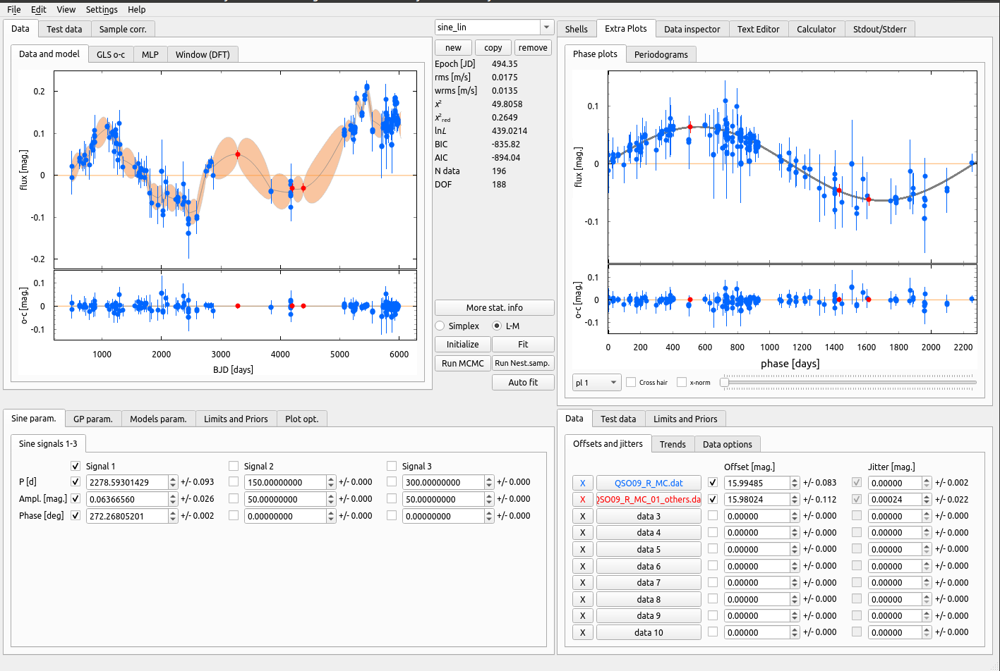

**The QSO-Striker** 

  

 
The "QSO-Striker" is a derivative of the "Exo-Striker", which is developed for modeling the variability of quasar light-curves (QSOs). It can perform MCMC and nested sampling, Gaussian Processes modeling a.k.a. Damped Random Walk (DRW) model. The QSO-Striker offers fast fully interactive plots, and export ready-to-use LaTeX tables with best-fit parameters, errors, and statistics. It combines Fortran efficiency and Python flexibility and is cross-platform compatible (MAC OS, Linux, Windows). 

 

  

**Developer**

* Trifon Trifonov, MPIA Heidelberg.
* Based on the Exo-Striker see [here](https://github.com/3fon3fonov/exostriker)

**What works**:

* Signal and alias search: via GLS periodogram & maximum lnL periodogram (MLP).
* Interactive photometry detrending, interactive outlier removal, and more.
* Simple deterministic model such ase multiple Sine fitting.
* Stochastic models via GP modeling, such as amped random walk (DRW) models.
* MCMC/Nested Sampling (via "emcee" & "dynesty") 
* Automated signal-finder algorithm
* Fully interactive, super-fast, high-quality, exportable plots.
* Handy "cornerplot" GUI control.
* Import/Export of work sessions and multi-sessions. 
* Export plots to a matplotlib window for further customization.
* Export ready to use LaTeX tables with best-fit parameters, errors, and statistics. 
* Handy text-editor and calculator tools.
* Multi-platform: It works on MAC OS (10.6+), Linux (Suse, Mint, Ubuntu, etc.) and Windows 10.
* Integrated Bash-shell (Linux only).
* Integrated Jupyter shell.
* Print the GUI screen into a .jpeg/.png image (useful for sharing quick results, just like the image above).

**What is to be implemented**:

* This is largely work in progress.  

Please keep in mind that this software is developed mostly for my needs and fun. I hope, however, that you may find it capable of solving your scientific problems, too. At the moment, there is NO documentation,
but as you will find, the GUI is self-explanatory.  

Feedback and help in further development will be highly appreciated!
A wish-list with your favorite tools and methods to be implemented is also welcome!    

Just open an "Issue" on the GitHub, or send a PM to trifonov@mpia.de.    

**Installation**

$ pip install git+https://github.com/3fon3fonov/qsostriker   

or git clone:

$ git clone https://github.com/3fon3fonov/qsostriker   
$ cd qsostriker   
$ python setup.py install   

However, please read the [Installation instructions](README_for_installation),
because some problems may occur depending on your OS system.   

Python3.6+ is strongly recommended. 

**Usage**

* To load the GUI, on a bash shell type: 

$ qsostriker (in case of pip install)

* or just do:

$ python qsostriker_gui.py (inside of the git clone directory)
 

* If you want to use the library on the Python shell/script

In [1]: import qsostriker

  

**Credit**

As stated above, QSO-Striker is a derivative of the Exo-Striker.

If you made the use of The QSO-Striker for your paper, I would appreciate it if you give credit to the Exo-Striker with its ASCL ID ascl:1906.004 (see https://ascl.net/1906.004).    
 
The QSO-Striker relies on many open-source packages, which if you had made the use of (some of) them while working with the tool, 
you should acknowledge too. (It is your responsibility to find the correct references in the literature):    

* The interactive plotting is done with a custom version of the "pyqtgraph": 

http://www.pyqtgraph.org/

* "GLS" and "MLP" periodograms are taken from Mathias Zechmeister's repo: 

https://github.com/mzechmeister/python
 
* MCMC sampling is done with "emcee": 

https://github.com/dfm/emcee

* Nested Sampling is done with "dynesty": 

https://github.com/joshspeagle/dynesty
 

* The "Text editor" used in the tool is a hack between "Megasolid Idiom" 
and "PyEdit2":

https://github.com/mfitzp/15-minute-apps/tree/master/wordprocessor

https://github.com/Axel-Erfurt/PyEdit2
 
* Additionally, the Exo-Striker uses many "standard" Python libraries like 
"PyQt5", "matplotlib", "numpy", "scipy", "dill", "Jupyter", "qtconsole",
and more.
 

**Scientific papers which one way or another made the use of the QSO-Striker (to my knowledge):**

* [Minev et al. (2021)](https://ui.adsabs.harvard.edu/abs/2021MNRAS.508.2937M/abstract)
 

